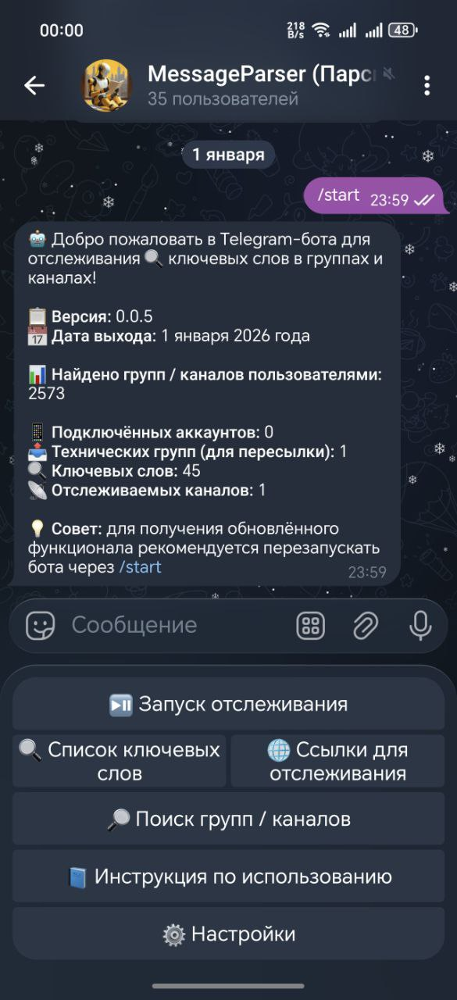

### 📡 Telegram бот для отслеживания ключевых слов и AI-поиска (https://t.me/AutoParseAlertBot)

[](https://www.python.org/)
[](https://docs.aiogram.dev/)
[](https://docs.telethon.dev/)

- **Версия:** 0.0.9
- **Дата обновления:** 02 июля 2026 года

Бот анализирует новые сообщения в указанных Telegram-группах и каналах в реальном времени, уведомляя о совпадениях по ключевым словам. Также использует ИИ (Groq, OpenRouter) для интеллектуального поиска новых тематических площадок.

## ✨ Ключевые особенности

- 🚀 **Real-time мониторинг:** Моментальная пересылка сообщений с ключевыми словами в вашу техническую группу.
- 🤖 **Двухуровневый AI-поиск:** Локальный поиск по базе и глобальный поиск по всему Telegram.
- 📊 **Экспорт в XLSX:** Выгрузка результатов поиска и мониторинга в Excel с фильтрацией по категориям и активности.
- 🛡️ **Админ-панель:** Инструменты для актуализации БД, массовой категоризации через AI и определения языка контента.
- 🌍 **Multi-language:** Полная поддержка русского и английского языков (Fluent i18n).
- 🔐 **Мультиаккаунтность:** Поддержка работы через несколько `.session` файлов (StringSession) для обхода лимитов.
- 💰 **Лимиты и Telegram Stars:** Ограничение на бесплатный экспорт базы данных (1 раз в 24 часа). Повторные скачивания доступны за 5 Telegram Stars (списание с баланса звезд или прямая оплата).

<p align="center">
  
</p>

## 📝 Основные функции

- **Мониторинг:** Отслеживание ключевых слов в неограниченном списке групп/каналов.
- **AI Поиск:** Нахождение новых целевых групп по смысловым запросам.
- **Интеллектуальный экспорт:** Получение базы по конкретным категориям (бизнес, крипта, работа и т.д.).
- **Определение активности:** Маркировка площадок статусами `active`, `inactive` или `unknown`.
- **Массовое добавление:** Загрузка списков мониторинга через `.txt` файлы.
- **Прокси:** Поддержка HTTP/SOCKS5 для стабильной работы AI и Telegram API.

## ⚙️ Быстрый старт

1. **Настройка окружения:**
   ```bash
   cp .env.example .env
   ```
   Заполните `.env` в корне проекта (обязательные поля: `BOT_TOKEN`, `ID`, `HASH`, `ADMIN_USER_IDS`).

2. **Установка зависимостей:**
   ```bash
   pip install -r requirements.txt
   ```

3. **Запуск:**
   ```bash
   python main.py
   ```

### Переменные окружения

| Переменная | Описание |
| :--- | :--- |
| `BOT_TOKEN` | Токен бота от @BotFather |
| `ID` / `HASH` | API credentials с [my.telegram.org](https://my.telegram.org) |
| `ADMIN_USER_IDS` | Telegram user ID администраторов через запятую |
| `WEBAPP_URL` | URL веб-панели для кнопки в боте (опционально) |
| `PORT` | Порт FastAPI (по умолчанию `8000`) |
| `BOT_MODE` | `polling` (по умолчанию) или `webhook` (prod с HTTPS) |
| `WEBHOOK_URL` | Полный HTTPS URL webhook, напр. `https://bot.example.com/webhook/telegram` |
| `WEBHOOK_SECRET` | Секрет для заголовка `X-Telegram-Bot-Api-Secret-Token` (рекомендуется в prod) |
| `REDIS_URL` | URL Redis для устойчивого отслеживания и FSM, напр. `redis://redis:6379/0` |
| `ENABLE_MOCK_AUTH` | `true` только для локальной разработки веб-панели |

## 🐳 Запуск в Docker

1. Заполните `.env` (обязательно `REDIS_URL=redis://redis:6379/0` для compose).
2. Для тестов оставьте `BOT_MODE=polling`.
3. Запуск:

```bash
docker compose up --build -d
```

4. Логи: `docker compose logs -f bot`
5. Перезапуск бота (отслеживание восстановится из Redis): `docker compose restart bot`

Тома Docker:
- `./data` — SQLite база (`data/bot.db`)
- `./accounts` — Telethon-сессии пользователей
- `./logs` — логи бота

**Важно:** запускайте один экземпляр бота на один Redis. Несколько реплик приведут к дублированию Telethon-сессий.

## 👑 Функции администратора

Для пользователей с правами администратора доступна панель управления:
- **🏷️ Категоризация:** Автоматическое распределение групп по тематикам с помощью LLM.
- **🌐 Языковой фильтр:** Определение языка общения в чатах для качественной выборки.
- **🔄 Актуализация:** Массовое обновление метаданных групп и проверка их существования.

## 📊 Определение активности

| Статус | Описание |
| :--- | :--- |
| 🟢 `active` | Последнее сообщение было опубликовано **≤ 30 дней** назад |
| 🔴 `inactive` | Последнее сообщение было **> 30 дней** назад |
| ⚪ `unknown` | Не удалось получить дату (ограничения приватности) |

---
## 🧑‍💻 Разработка

- **Framework:** `aiogram 3.x` (Bot API), `Telethon` (User API)
- **Database:** `SQLite` + `Peewee ORM`
- **State:** `Redis` (активные отслеживания, FSM aiogram)
- **AI:** `Groq`, `OpenRouter`, `G4F`
- **Localization:** `Project Fluent`

---
> 📘 Подробная справка доступна в файле [doc/doc.md](doc/doc.md) или через команду `/help` в боте.
